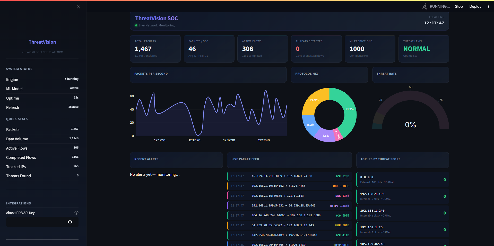

# NetVision SOC - Advanced Real-Time Network Threat Detection

NetVision SOC is a professional-grade Security Operations Center (SOC) dashboard designed for high-performance network traffic monitoring and multi-stage threat detection. Built with a focus on visual clarity and actionable intelligence, NetVision integrates real-time packet processing, flow-based feature extraction, and machine learning to secure network environments.



## 🚀 Key Features

- **Live Traffic Telemetry**: Real-time visualization of packet throughput (PPS), data volume, and active network flows.
- **ML-Powered Threat Detection**: Utilizes advanced machine learning models (XGBoost/RandomForest) to analyze flow patterns and distinguish between benign and malicious behavior.
- **Intelligent IP Tracking**: Automatically tracks and scores IPs based on their historical behavior and ML predictions.
- **AbuseIPDB Integration**: Seamlessly connects to the AbuseIPDB API for real-time IP reputation checks and whitelisting verification.
- **Cyber-Sleek UI**: A premium dark-mode interface with glassmorphism effects, designed for 24/7 SOC monitoring environments.
- **Deep Flow Analysis**: Extracts 20+ network features including IAT (Inter-Arrival Time), Flow Duration, and Packet Length Variance for high-fidelity detection.

## 🛠️ Technical Architecture

- **Frontend**: Streamlit Framework with Plotly.js for interactive visualizations and custom CSS for the dark-mode aesthetic.
- **Engine**: Multithreaded Python backend for simultaneous packet capture, flow extraction, and ML inference.
- **ML Pipeline**: 
  - Feature Engineering: Flow-based extraction from raw packets.
  - Model: Calibrated XGBoost/RandomForest with Temperature Scaling for high-confidence predictions.
  - Data: Trained on modern cybersecurity datasets (CICDDoS2019).

## 📋 Prerequisites

- **Python 3.8+**
- **Requirements**: `pip install -r requirements.txt`
- **AbuseIPDB API Key** (Optional): Create a `.env` file with `ABUSEIPDB_API_KEY=your_key_here`.

## ⚙️ Installation & Setup

1. **Clone the Project**:
   ```bash
   git clone https://github.com/BhanuPartapSinghRana/NetVision-SOC.git
   cd NetVision-SOC
   ```

2. **Install Dependencies**:
   ```bash
   pip install -r requirements.txt
   ```

3. **Run the Dashboard**:
   ```bash
   streamlit run final_dashboard.py
   ```

## 📊 How it Works

1. **Capture**: The engine listens for incoming network packets (simulated or live).
2. **Extract**: Packets are grouped into 5-tuple flows (Src IP, Dst IP, Src Port, Dst Port, Protocol).
3. **Analyze**: Once a flow is complete, the ML model predicts whether it matches known attack patterns (DDoS, Brute Force, etc.).
4. **Alert**: Malicious flows trigger instant UI alerts and update the Threat Score of the involved IPs.
5. **Verify**: Suspicious external IPs can be automatically verified against global threat databases.

## ⚖️ License

Distributed under the MIT License. See `LICENSE` for more information.

---
**Developed by Bhanu Partap Singh Rana**  
*Empowering Network Defense with AI*
